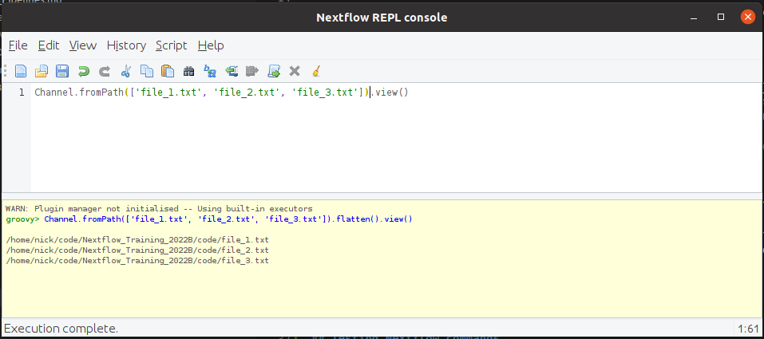
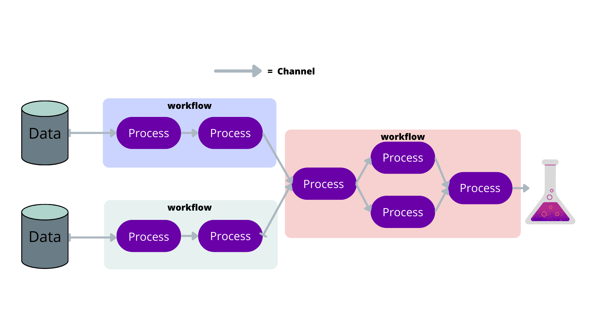

# What is Nextflow?
According to its website:
"[Nextflow](https://www.nextflow.io/) enables scalable and reproducible scientific workflows using software containers. It allows the adaptation of pipelines written in the most common scripting languages.
Its fluent DSL simplifies the implementation and the deployment of complex parallel and reactive workflows on clouds and clusters."


# Where to get help
The documentation for Nextflow can be found [here](https://www.nextflow.io/docs/latest/index.html) and is an excellent resource. I have included links to the relevant sections of the documentation in the headers of this tutorial's sections. There is also a [basic patterns](https://nextflow-io.github.io/patterns/index.html#_basic_patterns) which has examples or basic pipeline problems which can be very useful for beginners. There is also some [excellent training](https://training.seqera.io/) which also includes similar and more examples than what we will cover in this training. You can also ask for help on the [Nextflow slack channel](https://www.nextflow.io/slack-invite.html).


# Testing Nextflow commands
In the following sections we will go through several examples and we encourage you to copy and paste the code and have a play with it.
You can do this by either putting into a file and running that file using `nextflow run` or using `nextflow console`.
`nextflow console` is an interactive console which is great for testing out channel manipulations.
You can write on or more lines of code and press `Ctrl+r` to run it and see the output like so:

{: .width="400"}

The output does not clear the output or move you to the bottom of the output window.
To avoid confusion, it is best to clear the output window (using `Ctrl+w`) before rerunning the console.

# Nextflow components
Pipelines can be described using flowcharts.
Nextflow takes advantage of this by only requiring you to describe the parts of the flow chart, and Nextflow will put the pipeline together for you.

In the following sections, we shall describe the basic components of Nextflow to give you an understanding of the pipeline building blocks.
The following is a simple example of how the components work together to create a pipeline.

{: .width="400"}


## [Channel](https://www.nextflow.io/docs/latest/channel.html)
Often files or variables are handed to and from processes. Think of them as the arrows in a flow diagram.

Feel free to copy and paste these examples into the Nextflow console to follow along.

You can create channels of values using `of`:

```
ch = Channel.of( 1, 3, 5, 7 )
ch.view { "value: $it" }
```
{: .language-groovy}

which will output:

```
value: 1
value: 3
value: 5
value: 7
```
{: .output}

You can create channels of files using `fromPath`:

```
myFileChannel = Channel.fromPath( '/data/some/bigfile.txt' )
myFileChannel.view()
```
{: .language-groovy}

which, as long as the file exists, will output:

```
/data/some/bigfile.txt
```
{: .output}

You can also use wildcards to collect files:

```
myFileChannel = Channel.fromPath( '/data/some/*.txt' ).view()
```
{: .language-groovy}

which could output someting like:

```
/data/some/example_1.txt
/data/some/example_2.txt
/data/some/example_3.txt
```
{: .output}

## [Process](https://www.nextflow.io/docs/latest/process.html)
A process is a task you would like to include in your pipeline so it is the equivalent of a bubble in your flow chart.
It is written in bash by default and can have inputs and outputs.

Here is the syntax:

```
process < name > {

    [ directives ]

    input:
        < process inputs >

    output:
        < process outputs >

    when:
        < condition >

    [script|shell|exec]:
    < user script to be executed >

}
```
{: .language-groovy}

The script is surrounded by triple quotes and will use script by default.
In the scripts you can use the `$` notation do denote the input variables like you would with a bash script like so:

```
process script_example {
    input:
        file some_file
        val some_val

    script:
    """
    some_script --input $some_file --option ${some_val}
    """
}
```
{: .language-groovy}

Because bash also uses the `$` notation to denote values, we have to use `\$` to make Nextflow ignore the `$`
so it can still be used by bash. For example:

```
process script_example {
    input:
        file some_file
        val some_val

    script:
    """
    for bash_val in \$(seq 3); do
        some_script --input $some_file --option ${some_val} --other \${bash_val} --user \$USER
    done
    """
}
```
{: .language-groovy}

Because this can be confusing, you can instead use [shell](https://www.nextflow.io/docs/latest/process.html#shell)
which uses `!` to denote Nextflow values. So the above can instead be written as:

```
process shell_example {
    input:
        file some_file
        val some_val

    shell:
    """
    for bash_val in $(seq 3); do
        some_script --input !some_file --option !{some_val} --other ${bash_val} --user $USER
    done
    """
}
```
{: .language-groovy}


By default, the process will be executed as a bash script, but you can easily add the languages shebang to the first line of the script.
For example, you could write a python process like so:

```
process pythonStuff {
    """
    #!/usr/bin/python

    x = 'Hello'
    y = 'world!'
    print(f"{x} {y}")
    """
}
```
{: .language-groovy}

## Variables
Variables are easy to declare and similar to other languages.
You should treat variables as constants as soon as the pipeline begins.
If the variable is job-dependent, you should turn it into a channel.

You can use `params.<some_variable>` to define command line arguments.
This is very useful for specifying where input files are or other constants.
The equivalent command line argument uses two dashes like so `--<some_variable>`
(two dashes are for pipeline variables and single dashes are for Nextflow variables like `-resume`).

For example:
```
params.input_dir = "/data/some/dir"

myFileChannel = Channel.fromPath( '${params.input_dir}/*csv' )
```
{: .language-groovy}

This will create a channel of all the CSV files in `/data/some/dir/` by default, but this can also be changed by using
```
nextflow run example.nf --input_dir /some/other/dir/
```
{: .language-bash}
Will instead use the CSVs in `/some/other/dir/`

If something is constant throughout the pipeline, you can leave it as a variable.
One example could be some sort of observation identifier or date:

```
params.observation_id = 'default1234'

process make_files {
   output:
   file "*.txt"

   """for i in \$(seq 3); do touch ${params.observation_id}_\${i}_s_one.txt; done"""
}
```
{: .language-groovy}

You can see we're labelling the output files with the observation ID for all jobs.


## [Workflow](https://www.nextflow.io/docs/latest/dsl2.html#workflow)
A workflow is a combination of processes that will include the entire workflow or a sub part of it (will be explained in a later section).
This is where you will connect processes by their channels and and manipulate the channels so your pipeline runs in the required way.

```
workflow  {
    a_process( channel.from('/data/some/bigfile.txt') )
    another_process( a_process.out.collect() )
}
```
{: .language-groovy}

Note that we get output from processes with `.out`, if there are mutiple outputs from a process you can treat it like a list so if you want the first output channel grab it with `.out[0]`.

# Simple script

Let's dive right in and make a simple pipeline that will make a file then print the contents.
The flow chart for this pipeline will look like this:

{: .width="400"}

Here is how we would turn it into a pipeline as a script called `hello_world.nf`

```
params.message = "hello world"

process make_file {
    output:
        file "message.txt"

    """
    echo "${params.message}" > message.txt
    """
}

process echo_file {
    input:
        file message_file
    output:
        stdout

    """
    cat ${message_file} | tr '[a-z]' '[A-Z]'
    """
}

workflow {
   make_file()
   echo_file(make_file.out).view()
}
```
{: .language-groovy}

This script has two simple processes.
The first writes a variable to a file, then hands that file to the second process, which capitalises it and outputs it to the terminal.
You can execute this script on the command line using:

```
nextflow run hello_world.nf
```
{: .language-bash}

Which will output:

```
N E X T F L O W  ~  version 22.03.1-edge
Launching `hello_world.nf` [romantic_linnaeus] DSL2 - revision: 1298655152
executor >  local (2)
[8a/8f3033] process > make_file [100%] 1 of 1 ✔
[72/4df67e] process > echo_file [100%] 1 of 1 ✔
HELLO WORLD
```
{: .output}

Huzzah, we have run our first script!.
The output can be a bit confusing so lets go through it line by line.

```
N E X T F L O W  ~  version 22.03.1-edge
```
{: .output}
This is the Nextflow version you are using, you are likely using a more recent version than this.

```
Launching `hello_world.nf` [romantic_linnaeus] DSL2 - revision: 1298655152
```
{: .output}
This is the script you are running within the \`, this will show you the full path to the script if you're running it in a different directory.
`[romantic_linnaeus]` is a random name Nextflow gives to the run, it will change every time you run it.
`DSL2` is a Nextflow syntax extension which is now the default as it simlifies writing complex pipelines.
The revision is a hex that nextflow gives your pipeline and will only change if you change the pipeline scripts.

```
executor >  local (2)
```
{: .output}
This is a count of where the jobs where executed. In this example, two jobs were run locally.

```
[8a/8f3033] process > make_file [100%] 1 of 1 ✔
```
{: .output}
`[8a/8f3033]` is an identifier of the last job this processed launched (we will go into this in more detail later).
`process > make_file` this is the name of the process this line is describing.
`[100%] 1 of 1 ✔` this describes how many of this process has been launched and how many have finished successfully.

```
[72/4df67e] process > echo_file [100%] 1 of 1 ✔
```
{: .output}
This is the same as the above but for the `echo_file` process.

```
HELLO WORLD
```
{: .output}
This is the output of our pipeline.
Normally we don't output anything for our pipeline to the command line (outside of debugging) but we saw it because we used `.view()` on the output of `echo_file`.

If we want to view the `message.txt` file we have to do a little digging because it's not in the directory in which we called NextFlow.
NextFlow runs each process in it's own special directory so that concurrently running processes don't interfere with each other.
We'll describe this in more detail in the [next lesson]({{page.root}}).

> ## Simple script challenge
>
> For this challenge we will use the simple script from before:
>
> ~~~
> params.message = "hello world"
>
> process make_file {
>     output:
>         file "message.txt"
>
>     """
>     echo "${params.message}" > message.txt
>     """
> }
>
> process echo_file {
>     input:
>         file message_file
>     output:
>         stdout
>
>     """
>     cat ${message_file} | tr '[a-z]' '[A-Z]'
>     """
> }
>
> workflow {
>    make_file()
>    echo_file(make_file.out).view()
> }
> ~~~
> {: .language-groovy}
>
> Your challenge is to change the `echo_file` process so that it changes the message to lowercase (instead of uppercase).
> Then to confirm that it works, change the input message to "THIS SHOULD BE LOWERCASE" using the command line.
> 
> Remember to use the [etherpad](https://pad.carpentries.org/ADACS_NextFlow) to share your success or ask questions.
> > ## Soultion
> > This is the change to the `echo_file` process
> > ~~~
> > process echo_file {
> >     input:
> >         file message_file
> >     output:
> >         stdout
> >
> >     """
> >     cat ${message_file} | tr '[A-Z]' '[a-z]'
> >     """
> > }
> > ~~~
> > {: .language-groovy}
> > which when run like so:
> > ~~~
> > nextflow run simple_script_challange.nf --message "THIS SHOULD BE LOWERCASE"
> > ~~~
> > {:. language-bash}
> > will output
> > ~~~
> > N E X T F L O W  ~  version 22.04.5
> > Launching `simple_script_challange.nf` [wise_davinci] DSL2 - revision: e1bf2b9b55
> > executor >  local (2)
> > [40/bbe0be] process > make_file [100%] 1 of 1 ✔
> > [d1/044ad5] process > echo_file [100%] 1 of 1 ✔
> > this should be lowercase
> > ~~~
> > {: .output}
> {: .solution}
{: .challenge}


# All about channels and why we manipulate them?

The format of your channels is very important as it dictates how your pipeline will run.
Each row of a channel will spawn its own job for each process, so the shape of the channel informs Nextflow how many jobs to launch and what input each job has.
Manipulating channels is the most difficult parts of Nextlflow but it allows us create any type of pipeline.

So we have a channel of three files like so:
```
Channel.fromPath(['file_1.txt', 'file_2.txt', 'file_3.txt']).view()
```
{: .language-groovy}
```
/data/some/dir/file_1.txt
/data/some/dir/file_2.txt
/data/some/dir/file_3.txt
```
{: .output}

We have three rows with one file each. So if we input this to a process it would create three jobs.
If we instead wanted to create a single job that has access to all three files we can use the [`collect`](https://www.nextflow.io/docs/latest/operator.html#collect) operator like so:
```
Channel.fromPath(['file_1.txt', 'file_2.txt', 'file_3.txt']).collect().view()
```
{: .language-groovy}
```
[/data/some/dir/file_1.txt, /data/some/dir/file_2.txt, /data/some/dir/file_3.txt]
```
{: .output}
So now we have a single row of files. Just for fun, we can even use [`flatten`](https://www.nextflow.io/docs/latest/operator.html#flatten) to "flatten" them back to one file per row:

```
Channel.fromPath(['file_1.txt', 'file_2.txt', 'file_3.txt']).collect().flatten().view()
```
{: .language-groovy}
```
/data/some/dir/file_1.txt
/data/some/dir/file_2.txt
/data/some/dir/file_3.txt
```
{: .output}

## Channel Manipulation Example

Let's see what this channel manipulation looks like in a full workflow:

```
process make_files {
   output:
   file "file*.txt"

   """for i in \$(seq 3); do touch file_\${i}.txt; done"""
}

process each_file {
   echo true

   input:
   file each_file

   """echo 'I have each file: ${each_file}'"""
}

process all_files {
   echo true

   input:
   file all_files

   """echo 'I have all files: ${all_files}'"""
}

workflow {
   make_files()
   // flatten channel to make the dimensions 3 rows x 1 column
   each_file(make_files.out.flatten())
   // collect channgel to make the dimensions 1 row x 3 columns
   all_files(make_files.out.collect())
   // The above collect is redundant so you will get the same result from:
   // all_files(make_files.out)
}
```
{: .language-groovy}

Which will output:
```
N E X T F L O W  ~  version 22.03.1-edge
Launching `channels.nf` [boring_magritte] DSL2 - revision: d6c334a8a0
executor >  local (5)
[2d/daa992] process > make_files    [100%] 1 of 1 ✔
[b8/de87b0] process > each_file (3) [100%] 3 of 3 ✔
[9d/c5d625] process > all_files     [100%] 1 of 1 ✔
I have all files: file_1.txt file_2.txt file_3.txt

I have each file: file_1.txt

I have each file: file_2.txt

I have each file: file_3.txt
```
{: .output}

We can see from the process information that three instances of each_file was run:
```
[b8/de87b0] process > each_file (3) [100%] 3 of 3 ✔
```
{: .output}

Which had one file each:

```
I have each file: file_1.txt

I have each file: file_2.txt

I have each file: file_3.txt
```
{: .output}

And all_files ran once:

```
[9d/c5d625] process > all_files     [100%] 1 of 1 ✔
```
{: .output}

With access to all three files:

```
I have all files: file_1.txt file_2.txt file_3.txt
```
{: .output}


## [Operators](https://www.nextflow.io/docs/latest/operator.html#)
Now that we know how to make simple pipelines, lets delve into [Operators](https://www.nextflow.io/docs/latest/operator.html#) to manipulate channels to create your desired pipeline.


Channel manipulation is likely the most challenging part of Nextflow, so we will go through some of the most useful operators and use them for progressively more complicated examples.


### [map](https://www.nextflow.io/docs/latest/operator.html#map)
Map is a useful transforming operator that you can use to apply a function to each item in a channel.
Map functions are expressed using a closure which are curly brackets that allow us to pass code as arguments to a function.
For example, you could square all numbers in a channel like so:

```
Channel
    .from( 1, 2, 3, 4, 5 )
    .map { it * it }
    .view()
```
{: .language-groovy}
where `it` describes each item as `map` iterates over the channel. This will output:

```
1
4
9
16
25
```
{: .output}

You can use `map` to manipulate multi column rows in different ways:

```
Channel
    .from( [1,'A_B'], [2,'B_C'], [3,'C_D'])
    .map { it -> [ it[0], it[0] * it[0], it[1].split("_")[0], it[1].split("_")[1] ] }
    .view()
```
{: .language-groovy}
```
[1, 1, A, B]
[2, 4, B, C]
[3, 9, C, D]
```
{: .output}

### [groupTuple](https://www.nextflow.io/docs/latest/operator.html#grouptuple)
`groupTuple` is used to group channel items with the same key, which is the first item by default.

For example:
```
Channel
    .from( [1,'A'], [1,'B'], [2,'C'], [3, 'B'], [1,'C'], [2, 'A'], [3, 'D'] )
    .groupTuple()
    .view()
```
{: .language-groovy}
```
[1, [A, B, C]]
[2, [C, A]]
[3, [B, D]]
```
{: .output}

This operator is often used to group files by their name.
So if we make some test files like so:

```
for i in \$(seq 3 ); do
    for j in \$(seq 3 ); do
        touch file_\${i}_s_\${j}.txt
    done
done
```
{: .language-bash}

We can use `map` to create a key based on the file name and then use `groupTuple` to group them together in any way you want.
For example we can group them by the name before "_s_":

```
Channel
    .fromPath("file_*_s_*.txt")
    // Create a prefix key and file pair
    .map{ it -> [it.baseName.split("_s_")[0], it ] }.view{"step 1: $it"}
    // Group the files by this prefix
    .groupTuple().view{"step 2: $it"}
    // Remove the key so it can be easily input into a process
    .map{ it -> it[1] }.view{"step 3: $it"}
```
{: .language-groovy}
```
step 1: [file_1, /data/some/dir/file_1_s_1.txt]
step 1: [file_3, /data/some/dir/file_3_s_3.txt]
step 1: [file_2, /data/some/dir/file_2_s_2.txt]
step 1: [file_2, /data/some/dir/file_2_s_3.txt]
step 1: [file_3, /data/some/dir/file_3_s_1.txt]
step 1: [file_1, /data/some/dir/file_1_s_3.txt]
step 1: [file_2, /data/some/dir/file_2_s_1.txt]
step 1: [file_1, /data/some/dir/file_1_s_2.txt]
step 1: [file_3, /data/some/dir/file_3_s_2.txt]
step 2: [file_1, [/data/some/dir/file_1_s_1.txt, /data/some/dir/file_1_s_3.txt, /data/some/dir/file_1_s_2.txt]]
step 2: [file_3, [/data/some/dir/file_3_s_3.txt, /data/some/dir/file_3_s_1.txt, /data/some/dir/file_3_s_2.txt]]
step 2: [file_2, [/data/some/dir/file_2_s_2.txt, /data/some/dir/file_2_s_3.txt, /data/some/dir/file_2_s_1.txt]]
step 3: [/data/some/dir/file_1_s_1.txt, /data/some/dir/file_1_s_3.txt, /data/some/dir/file_1_s_2.txt]
step 3: [/data/some/dir/file_3_s_3.txt, /data/some/dir/file_3_s_1.txt, /data/some/dir/file_3_s_2.txt]
step 3: [/data/some/dir/file_2_s_2.txt, /data/some/dir/file_2_s_3.txt, /data/some/dir/file_2_s_1.txt]
```
{: .output}

You can see that in the final steps we have grouped our files and this channel is ready to be given to a process that will create three jobs with three files each.

### [concat](https://www.nextflow.io/docs/latest/operator.html#concat)
The `concat` operator concatenates items from two or more channels to a new channel in the same order they were specified in.

For example:
```
a = Channel.from('a','b','c')
b = Channel.from(1,2,3)
c = Channel.from('p','q')

c.concat( b, a ).view()
```
{: .language-groovy}
```
p
q
1
2
3
a
b
c
```
{: .output}

> ## Concat challenge
>
> Here is an example of an incomplete pipeline that combines the output of two processes and grouping them by their filename.
>
> ~~~
> process make_files_one {
>    output:
>    file "file*.txt"
>
>    """for i in \$(seq 3); do touch file_\${i}_s_one.txt; done"""
> }
>
> process make_files_two {
>    output:
>    file "file*.txt"
>
>    """for i in \$(seq 3); do touch file_\${i}_s_two.txt; done"""
> }
>
>
> process grouped_files {
>    echo true
>
>    input:
>    tuple file(first_file), file(second_file)
>    """echo 'I have ${first_file} and ${second_file}'"""
> }
>
> workflow {
>    make_files_one()
>    make_files_two()
>    // Label the files with their prefix
>    files_one = make_files_one.out.flatten().map{ it -> [it.baseName.split("_s_")[0], it ] }
>    files_two = make_files_two.out.flatten().map{ it -> [it.baseName.split("_s_")[0], it ] }
>    grouped_files(
>        // Concat them with the other process
>        // YOUR CODE HERE
>        // Group the files by this prefix then remove the prefix
>        // YOUR CODE HERE
>     )
> }
> ~~~
> {: .language-groovy}
>
> Your challenge is to complete the pipeline by combining the `files_one` and `files_two` channels using
> `concat` and group them (using `groupTuple` and `map`) so that the output of the `grouped_files` looks similar to this:
>
> ~~~
> N E X T F L O W  ~  version 21.04.3
> Launching `channel_tuples.nf` [stoic_liskov] - revision: 79877921ac
> executor >  local (5)
> [b2/7e78a1] process > make_files_one    [100%] 1 of 1 ✔
> [bc/285fad] process > make_files_two    [100%] 1 of 1 ✔
> [bc/da6cc3] process > grouped_files (1) [100%] 3 of 3 ✔
> I have file_2_s_one.txt and file_2_s_two.txt
>
> I have file_3_s_one.txt and file_3_s_two.txt
>
> I have file_1_s_one.txt and file_1_s_two.txt
> ~~~
> {: .output}
> 
> Use the [etherpad](https://pad.carpentries.org/ADACS_NextFlow) to let us know how you are going.
> > ## Soultion
> > ~~~
> > workflow {
> >    make_files_one()
> >    make_files_two()
> >    // Label the files with their prefix
> >    files_one = make_files_one.out.flatten().map{ it -> [it.baseName.split("_s_")[0], it ] }
> >    files_two = make_files_two.out.flatten().map{ it -> [it.baseName.split("_s_")[0], it ] }
> >    grouped_files(
> >        // Concat them with the other process
> >        files_one.concat(files_two)
> >        // Group the files by this prefix then remove the prefix
> >        .groupTuple().map { it -> [ it[1][0], it[1][1] ] }
> >     )
> > }
> > ~~~
> > {: .language-groovy}
> {: .solution}
{: .challenge}


## [splitCsv](https://www.nextflow.io/docs/latest/operator.html#splitcsv)
CSVs are excellent ways to input data to your pipeline or even to hand data between processes.
`splitCsv` can handle text and parse it to several rows:

```
Channel
    .from( 'alpha,beta,gamma\n10,20,30\n70,80,90' )
    .splitCsv()
    .view()
```
{: .language-groovy}
```
[alpha, beta, gamma]
[10, 20, 30]
[70, 80, 90]
```
{: .output}

You can also hand csv files directly to `splitCsv` which makes handling these files easy.
A test CSV can be created with:

```
echo alpha,beta,gamma > test.csv; echo 10,20,30 >> test.csv; echo 70,80,90 >> test.csv
```
{: .language-bash}

Then you can use the following operators to parse the CSV file:

```
Channel
    .fromPath( 'test.csv' )
    .splitCsv()
    .view()
```
{: .language-groovy}
```
[alpha, beta, gamma]
[10, 20, 30]
[70, 80, 90]
```
{: .output}


## [cross](https://www.nextflow.io/docs/latest/operator.html#cross)
The `cross` operator allows you to combine the items of two channels in such a way that the items of the source channel are emitted along with the items emitted by the target channel for which they have a matching key.
An example of when this is useful is when you need to launch a job for each pair of data files and candidates found in those data files.
For example if you had two channels, the first the data files for each observation and a second channel with all of the candidates, we can combined them by using the observation ID as a common key:

```
source = Channel.from( ['obs1', 'obs1.dat'], ['obs2', 'obs2.dat'] )
target = Channel.from( ['obs1', 'obs1_cand1.dat'], ['obs1', 'obs1_cand2.dat'], ['obs1', 'obs1_cand3.dat'], ['obs2', 'obs2_cand1.dat'] , ['obs2', 'obs2_cand2.dat'] )

source.cross(target).view()
```
{: .language-groovy}
```
[[obs1, obs1.dat], [obs1, obs1_cand1.dat]]
[[obs1, obs1.dat], [obs1, obs1_cand2.dat]]
[[obs1, obs1.dat], [obs1, obs1_cand3.dat]]
[[obs2, obs2.dat], [obs2, obs2_cand1.dat]]
[[obs2, obs2.dat], [obs2, obs2_cand2.dat]]
```
{: .output}

This can easily be maped to a process that will launch a job for each observation data file and candidate information.

> ## Cross Challange
>
> Similar to the previous example, you have of your observation data files and the observation candidates:
>
> ~~~
> data = Channel.from( ['obs1.dat', 'obs2.dat'] )
> candidates = Channel.from( ['obs1_cand1.dat', 'obs1_cand2.dat', 'obs1_cand3.dat', 'obs2_cand1.dat', 'obs2_cand2.dat'] )
> ~~~
> {: .language-groovy}
>
> You want to `map` the data so that the observation name can be used as a key, `cross` them so each
> candidate has a observation data file, the reformat them so they're in the format:
> ~~~
> [obsname, obs_data, obs_cand]
> eg:
> [obs1, obs1.dat, obs1_cand1.dat]
> ~~~
> {: .language-groovy}
> 
> Share your answer or ask questions via the [etherpad](https://pad.carpentries.org/ADACS_NextFlow).
> > ## Solution
> > ~~~
> > // Use map to get an observation key
> > data = data.map { it -> [ it.split("_")[0], it ] }
> > candidates = candidates.map { it -> [ it.split("_")[0], it ] }
> > // Cross the data
> > data.cross(candidates)
> >     // Reformat to desired output
> >     .map { it -> [ it[0][0], it[0][1], it[1][1] ] }.view()
> > ~~~
> > {: .language-groovy}
> {: .solution}
{: .challenge}


