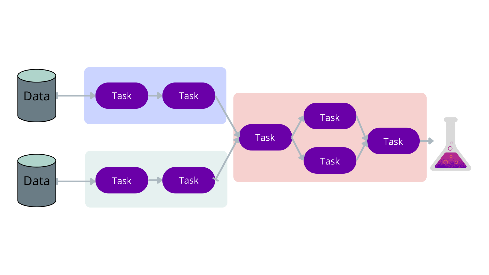

# What is a pipeline?
A pipeline is a sequence of jobs that are excuted to process data.
Pipelines are often first planned out using flow charts to work out what order the tasks needs to be performed in, what the dependancies are and what the inputs and outputs are.

{: .width="400"}

If each job is manually executed by a user this is still a pipeline but we should aim to automate as much of our pipelines as possible to save time.
As pipelines grow they often become complicated it can be difficult to do the following:
- Keep the pipeline clear, readable and maintable
- Track errors and rerun failed jobs
- Benchmark jobs to find bottlenecks
- Handle dependancies such as containers
- Stop a pipeline then resume where it left off

To help with the above it is best your use a pipeline language, such as Nextflow, to develop your pipelines.

# What is Nextflow?
According to its website:
"[Nextflow](https://www.nextflow.io/) enables scalable and reproducible scientific workflows using software containers. It allows the adaptation of pipelines written in the most common scripting languages.

Its fluent DSL simplifies the implementation and the deployment of complex parallel and reactive workflows on clouds and clusters."


# Nextflow components
Pipelines can be described using flowcharts.
Nextflow takes advantage of this by only requiring you to describe the parts of the flow chart, and Nextflow will put the pipeline together for you.

In the following sections we shall describe the basic components of Nextflow to give you an understanding of the pipeline building blocks.
The following is a simple example of how the components work together to create a pipeline.

{: .width="400"}

## Simple script
Here is a simple example of a script called `hello_world.nf`

```
params.message = "hello world"

process make_file {
    output:
        file "message.txt"

    """
    echo "${params.message}" > message.txt
    """
}

process echo_file {
    input:
        file message_file
    output:
        stdout

    """
    cat ${message_file} | tr '[a-z]' '[A-Z]'
    """
}

workflow {
   make_file()
   echo_file(make_file.out).view()
}
```
{: .language-javascript}

This script has two simple processes.
The first writes a variable to a file then hands that file to the second process which capitalises it and outputs it to the terminal.
You can execute this script on the command line using:

```
nextflow run hello_world.nf
```
{: .language-bash}

Which will output:

```
N E X T F L O W  ~  version 22.03.1-edge
Launching `hello_world.nf` [romantic_linnaeus] DSL2 - revision: 1298655152
executor >  local (2)
[8a/8f3033] process > make_file [100%] 1 of 1 ✔
[72/4df67e] process > echo_file [100%] 1 of 1 ✔
HELLO WORLD
```
{: .output}

You can see that that each process is run once and outputs the capitalised message to the terminal.


## [Process](https://www.nextflow.io/docs/latest/process.html)
Documentation: https://www.nextflow.io/docs/latest/process.html
A process is a type of job you would like to include in your pipeline.
It is written in bash by default and can have inputs and outputs.

Here is the syntax:

```
process < name > {

   [ directives ]

   input:
    < process inputs >

   output:
    < process outputs >

   when:
    < condition >

   [script|shell|exec]:
   < user script to be executed >

}
```
{: .language-javascript}

By default the process will be executed as bash script but you can easily adding the languages shebang to the first line of the script.
For example you could write a python process like so:

```
process pythonStuff {
    """
    #!/usr/bin/python

    x = 'Hello'
    y = 'world!'
    print(f"{x} {y}")
    """
}
```
{: .language-javascript}

### [Label](https://www.nextflow.io/docs/latest/process.html#label)
You can label your process which is a useful way to group your processes that need a similar configuration.
For example you could label all processes that require a certain container or need a lot of memory like so:

```
process bigTask {
  label 'big_mem'

  """
  <task script>
  """
}
```
{: .language-javascript}

We will explain how to take advantage of labels in the Nextflow Configuration lesson.

### [publishDir](https://www.nextflow.io/docs/latest/process.html#publishdir)
Used to output files to a directory outside of the Nextflow work directory.
For example:

```
process foo {
    publishDir '/home/data/'

    output:
    file 'science.data'

    '''
    echo "Some Science" > science.data
    '''
}
```
{: .language-javascript}

This will output the science.data file to /home/data

## [Channel](https://www.nextflow.io/docs/latest/channel.html)
Often files or variables that are handed to and from processes. Think of them as the arrows in a flow diagram.

You can create channels of values using of:

```
ch = Channel.of( 1, 3, 5, 7 )
ch.view { "value: $it" }
```
{: .language-javascript}

which will output:

```
value: 1
value: 3
value: 5
value: 7
```
{: .output}

You can create channels of files using formPath:

```
myFileChannel = Channel.fromPath( '/data/some/bigfile.txt' )
```
{: .language-javascript}

or with wildcards:

```
myFileChannel = Channel.fromPath( '/data/big/*.txt' )
```
{: .language-javascript}

Each row of a channel will spawn it's own job for each process.
You can use `flatten` to turn a channel into a single column that will spawn on job each or `collect` to spawn a single job with all files.
Here is an example to show this:

```
process make_files {
   output:
   file "file*.txt"

   """for i in \$(seq 3); do touch file_\${i}.txt; done"""
}

process each_file {
   echo true

   input:
   file each_file

   """echo 'I have each file: ${each_file}'"""
}

process all_files {
   echo true

   input:
   file all_files

   """echo 'I have all files: ${all_files}'"""
}

workflow {
   make_files()
   each_file(make_files.out.flatten().view{"flatten: $it.baseName"})
   all_files(make_files.out.collect().view{"collect: $it.baseName"})
}
```
{: .language-javascript}

Which will output:
```
N E X T F L O W  ~  version 22.03.1-edge
Launching `channels.nf` [boring_magritte] DSL2 - revision: d6c334a8a0
executor >  local (5)
[2d/daa992] process > make_files    [100%] 1 of 1 ✔
[b8/de87b0] process > each_file (3) [100%] 3 of 3 ✔
[9d/c5d625] process > all_files     [100%] 1 of 1 ✔
flatten: file_1
collect: [file_1, file_2, file_3]
flatten: file_2
flatten: file_3
I have all files: file_1.txt file_2.txt file_3.txt

I have each file: file_1.txt

I have each file: file_2.txt

I have each file: file_3.txt
```
{: .output}
You can combine and manipulate channels to hand your processes all the files it requires.
Channel manipulation is likely the hardest part of nextflow so we have an entire section dedicated to it later on.

## Variable
Variables are things you set at run time or want to put into channel. Constant no matter what the job is


## Workflow
A workflow is a collection of processes, very modular like python functions

## Configuration
The configuration (normally held within the nextflow.config file) describes all the machine dependent aspects of the pipeline.
Use to set up how you want to run your pipeline on your machine.
If you want to run it localy you might want to tell it the max number of CPU threads to use or where to put the output files
If you are on a HPC cluster will want to set up which job queue to use (e.g. SLURM) and how much resources you want each job to use (CPUs and RAM).
If you don't have a software dependancy installed, you can tell Nextflow which container to use.

This can all be done within the nextflow.config file.
