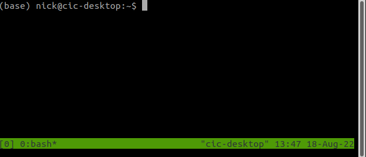
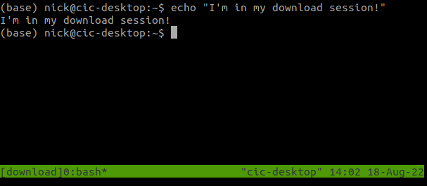

# How to run a Nextflow pipeline

Nextflow pipelines are launched from the command line like so:

```
nextflow run hello_world.nf
```
{: .language-bash}

You can also put your Nextflow pipelines on your PATH and treat them as you would other executables as long as they have the following shebang:
```
#!/usr/bin/env nextflow

```
{: .language-javascript}

With that running your pipeline becomes as easy as
es are launched from the command line like so:

```
hello_world.nf
```
{: .language-bash}

Which will have the output:
```
N E X T F L O W  ~  version 22.03.1-edge
Launching `/home/nick/code/Nextflow_Training_2022B/code/hello_world.nf` [jolly_descartes] DSL2 - revision: 582ccc5833
executor >  local (2)
[94/4b9b86] process > make_file [100%] 1 of 1 ✔
[88/adf190] process > echo_file [100%] 1 of 1 ✔
HELLO WORLD
```
{: .output}
You can see from the output that the location of the script is shown next to `Launching`.

## Using terminal multiplexers

Nextflow pipelines do not run in the background by default, so it is best to use a terminal multiplexer if running a long pipeline.
Terminal multiplexers allow you to have multiple windows within a single terminal window.
The benefit of these for running Nextflow pipelines is that you can detach from these terminal windows and reattach them later (even through an ssh connection) to check on the pipeline's progress.

The two most common terminal multiplexers are `screen` and `tmux`. We advise using `tmux` when possible as it is just as easy to use and has some [excellent features](https://www.howtogeek.com/671422/how-to-use-tmux-on-linux-and-why-its-better-than-screen/) but will also explain how to use `screen`.

### Tmux

Installing `tmux` on Ubuntu is as easy as running:

```
sudo apt-get install tmux
```
{: .language-bash}

You can start a tmux session by simply running:

```
tmux
```
{: .language-bash}

{: .width="400"}

We are now in a `tmux` session which has been named 0. By default, `tmux` will number your sessions from 0.
You can access the `tmux` commands by pressing `Ctrl+b`.
To kill the session, you can use `Ctrl+d` or `Ctrl+b` then `x`.
To detach from the screen, use `Ctrl+b` then `d`.

To reattach to the screen using the command:

```
tmux attach-session -t <session_name>
```
{: .language-bash}

So for our session:

```
tmux attach-session -t 0
```
{: .language-bash}

Using the default numbered names will quickly get confusing, so we should give our sessions meaningful names instead.
For example, if you want to launch a download job, you could make a named session with:

```
tmux new -s download
```
{: .language-bash}

{: .width="400"}

You can see at the bottom of the screen that we are now on a session called download.
We can detach (with `Ctrl+b` then `d`) and reattach (with `tmux attach-session -t download`), and you will still see the same display as when you detached.

You can now make several sessions with different names and switch back and forth between them to check the progress of your pipelines.

### Screen
`screen` is similar to `tmux`, so we will quickly go over the equivalent commands.

To make a named session use:

```
screen -S <screen_name>
```
{: .language-bash}

There isn't a bar at the bottom of your new session like in `tmux`, so you will have to remember if you're within a session or not.
To perform screen commands, you first press `Ctrl+a` then to detach and click `d`.

Then you can reattach it with
```
screen -r <screen_name>
```
{: .language-bash}


## Where are each of these jobs running?
Nextflow jobs are all run within a work directory.
By default, the work directory is `./work` but it can be altered by setting
```
workDir = "/data/dir/for/work"

```
{: .language-javascript}

in the `nextflow.config` file or on the command line with `-w /data/dir/for/work`.

For each job that nextflow runs, it will create a subdirectory and run the job there.
Let's use one of the outputs of our simple `hello_world.nf` script as an example:

```
N E X T F L O W  ~  version 22.03.1-edge
Launching `/home/nick/code/Nextflow_Training_2022B/code/hello_world.nf` [nostalgic_kare] DSL2 - revision: 582ccc5833
executor >  local (2)
[23/9bf45d] process > make_file [100%] 1 of 1 ✔
[9d/9c5ecd] process > echo_file [100%] 1 of 1 ✔
HELLO WORLD
```
{: .output}
The characters on the left between the square brackets describe the most recent launched job for that process.
So if we want to investigate the `make_file` job, we can move into its subdirectory like so:

```
cd work/23/9bf45d111e14368b2438367f6813c2/
```
{: .language-bash}

Where I have copied `23/9bf45d` and then used the tab to complete the 30-character hex that Nextflow uses to create the subdirectory.
Let's see what is within the subdirectory:

```
ls
```
{: .language-bash}

```
message.txt
```
{: .output}
We can see the `message.txt` file we created in our process.
If we want to investigate the files that Nextflow creates, we must look at the hidden files:
```
ls -a
```
{: .language-bash}

```
.
..
.command.begin
.command.err
.command.log
.command.out
.command.run
.command.sh
.exitcode
message.txt
```
{: .output}

Let us go through what each of these files does:

.command.begin: This file is created once the job has begun (no longer in a queue)

.exitcode: Once the job has complete, this file will be created with the exit code (0 means finished successfully and other numbers are errors)

.command.out: The standard output (stdout) of the job

.command.err: The standard error (stderr) of the job

.command.log: Both the standard output and error of the job.
This file is very useful for debugging as it will contain all outputs of the code.
You can use `tail -f .command.log` to see what the job is outputting in real-time.

.command.sh: This is the code that your job is going to run.
It will look like the code from your process with all the values of your attributes.

.command.run: "Here there be monsters".
This file contains all the magic that Nextflow uses to run your job.
You do not have to understand what it is doing, but when using Nextflow on a supercomputing cluster, there are a few useful things in this file including:
the SLURM SBATCH commands in the header,
the modules you load,
and the container command (singularity or docker).

### Finding jobs using a trace report
If you find a job that wasn't the most recent, the easiest way to find it using the [trace report](https://www.nextflow.io/docs/latest/tracing.html#trace-report).
To output a a trace report use the `-with-trace` command line option like so:

```
nextflow run <pipeline name> -with-trace
```
{: .language-bash}

This will output a file named `trace.txt` which will output a tab seperated file but for readability I have converted it to a table:

task_id | hash | native_id | name | status | exit | submit | duration | realtime | %cpu | peak_rss | peak_vmem | rchar | wchar
---|---|---|---|---|---|---|---|---|---|---|---|---|---
2 | 77/9d803f | 30901 | get_version | CACHED | 0 | 2022-04-12 16:04:06.504 | 832ms | 5ms | 76.9% | 0 | 0 | 55 KB | 229 B
3 | d7/b13e5b | 330369 | bane_raw (1) | CACHED | 0 | 2022-04-14 15:33:31.335 | 1.8s | 1s | 95.2% | 11.1 MB | 16.1 MB | 8.1 MB | 91.2 KB
4 | fc/1941a3 | 330938 | bane_raw (2) | CACHED | 0 | 2022-04-14 15:33:32.308 | 1.5s | 966ms | 99.9% | 11.1 MB | 16.1 MB | 8.1 MB | 91.2 KB
5 | be/adec6e | 331297 | bane_raw (3) | CACHED | 0 | 2022-04-14 15:33:33.181 | 1.5s | 961ms | 99.9% | 10.7 MB | 16.1 MB | 8.1 MB | 91.2 KB
6 | c2/ba3e2e | 348200 | initial_sfind (1) | COMPLETED | 0 | 2022-04-14 16:14:31.258 | 3.4s | 2.6s | 92.8% | 166.8 MB | 2 GB | 33.8 MB | 96.1 KB
8 | 5c/67bac7 | 348867 | initial_sfind (3) | COMPLETED | 0 | 2022-04-14 16:14:34.678 | 3s | 2.4s | 96.3% | 166.6 MB | 2 GB | 33.8 MB | 96 KB
7 | 30/29f5ee | 349396 | initial_sfind (2) | COMPLETED | 0 | 2022-04-14 16:14:37.689 | 3.1s | 2.5s | 94.0% | 166.9 MB | 2 GB | 33.8 MB | 96 KB
1 | 22/f4e019 | 348175 | download_gleam_catalogue | COMPLETED | 0 | 2022-04-14 16:14:31.240 | 18.3s | 17.5s | 25.0% | 264.7 MB | 1.1 GB | 9.8 MB | 44.3 MB
9 | db/d98083 | 350074 | fits_warp (1) | COMPLETED | 0 | 2022-04-14 16:14:49.549 | 7.1s | 5.6s | 84.2% | 305.7 MB | 5.2 GB | 55.3 MB | 776.3 KB
10 | 23/fb45cc | 350082 | fits_warp (2) | COMPLETED | 0 | 2022-04-14 16:14:49.552 | 7.2s | 5.6s | 85.3% | 305.2 MB | 5.2 GB | 55.3 MB | 775.9 KB
11 | 6a/48bd36 | 352365 | fits_warp (3) | COMPLETED | 0 | 2022-04-14 16:14:56.643 | 6.5s | 5.3s | 87.7% | 547.6 MB | 9.8 GB | 55.3 MB | 826.4 KB
12 | 29/304cf8 | 353616 | make_mean_image | COMPLETED | 0 | 2022-04-14 16:15:03.106 | 749ms | 117ms | 98.8% | 3.2 MB | 5.6 MB | 677.3 KB | 408.3 KB
13 | e9/fe10ba | 353955 | bane_mean_image | COMPLETED | 0 | 2022-04-14 16:15:03.865 | 2.2s | 1.6s | 94.9% | 102.4 MB | 3 GB | 8.1 MB | 102.5 KB
14 | 05/3b2508 | 354339 | sfind_mean_image | COMPLETED | 0 | 2022-04-14 16:15:06.029 | 3.6s | 3s | 96.6% | 167.2 MB | 2 GB | 33.8 MB | 99.2 KB
15 | 2d/10b294 | 354796 | mask_images (1) | COMPLETED | 0 | 2022-04-14 16:15:09.677 | 2.4s | 1.4s | 93.1% | 103.9 MB | 1.7 GB | 21.4 MB | 45.6 KB
17 | 06/8f74e6 | 354808 | mask_images (2) | COMPLETED | 0 | 2022-04-14 16:15:09.683 | 2.5s | 1.5s | 94.9% | 96.8 MB | 1.7 GB | 21.4 MB | 45.6 KB
20 | e8/cc1f75 | 355540 | mask_images (3) | COMPLETED | 0 | 2022-04-14 16:15:12.093 | 2s | 1.3s | 95.7% | 118.6 MB | 1.7 GB | 21.4 MB | 45.6 KB
16 | ec/a0a5b8 | 355611 | source_monitor (1) | COMPLETED | 0 | 2022-04-14 16:15:12.189 | 4.3s | 3.7s | 96.8% | 165.4 MB | 2 GB | 44.4 MB | 118.5 KB
18 | 6d/f0d725 | 356204 | source_monitor (3) | COMPLETED | 0 | 2022-04-14 16:15:14.077 | 4.2s | 3.6s | 96.8% | 166.6 MB | 18.3 GB | 44.4 MB | 118.5 KB
19 | d9/c3773c | 356757 | source_monitor (2) | COMPLETED | 0 | 2022-04-14 16:15:16.499 | 4.5s | 3.8s | 96.5% | 166.8 MB | 18.3 GB | 44.4 MB | 118.5 KB
21 | c9/7bd0b6 | 357308 | sfind_masked (1) | COMPLETED | 0 | 2022-04-14 16:15:18.233 | 4.6s | 4s | 96.2% | 167.4 MB | 2 GB | 56 MB | 102.1 KB
22 | a7/115d00 | 357951 | sfind_masked (2) | COMPLETED | 0 | 2022-04-14 16:15:20.968 | 4.5s | 3.8s | 96.5% | 165.8 MB | 2 GB | 56 MB | 90.7 KB
24 | c3/ea3979 | 358988 | join_fluxes | COMPLETED | 0 | 2022-04-14 16:15:25.461 | 1.3s | 698ms | 98.4% | 11.1 MB | 16.1 MB | 9.1 MB | 22.5 KB
23 | 87/5fd3d6 | 358416 | sfind_masked (3) | COMPLETED | 0 | 2022-04-14 16:15:22.854 | 4.9s | 4.3s | 97.1% | 166.6 MB | 2 GB | 56 MB | 90.8 KB
26 | b7/03301d | 359719 | compile_transients_candidates | COMPLETED | 0 | 2022-04-14 16:15:27.770 | 1.2s | 677ms | 95.2% | 10.7 MB | 16.1 MB | 8.9 MB | 17.3 KB
25 | f3/6253e7 | 359393 | compute_stats | COMPLETED | 0 | 2022-04-14 16:15:26.781 | 2.6s | 1.9s | 95.4% | 41.8 MB | 851.8 MB | 23.3 MB | 21.5 KB
27 | 2f/2f1f3b | 360080 | transients_plot | COMPLETED | 0 | 2022-04-14 16:15:28.993 | 2.3s | 1.6s | 97.8% | 70.5 MB | 1 GB | 21.1 MB | 172.9 KB
28 | fc/33d0e0 | 360250 | plot_lc | COMPLETED | 0 | 2022-04-14 16:15:29.353 | 16.1s | 15.4s | 93.9% | 190.8 MB | 2.1 GB | 452.9 MB | 1.6 MB

This can be used to find the hashes of all jobs with a certain name, with an FAILED status or baseh on the duration etc.


## How to debug a Nextflow Job

To explain how to debug Nextflow, let us make a simple Nextflow pipeline with an intentional error:

```
process python_job {
    output:
        stdout

    """
    #!/usr/bin/env python
    for i in range(3):
        print i
    """
}

workflow {
   python_job()
}
```
{: .language-javascript}

When I run this pipeline, Nextflow will output a verbose error message:

```
N E X T F L O W  ~  version 22.03.1-edge
Launching `error_check.nf` [loving_wescoff] DSL2 - revision: 44ac86534d
executor >  local (1)
executor >  local (1)
[28/ddb3ee] process > python_job [100%] 1 of 1, failed: 1 ✘
Error executing process > 'python_job'

Caused by:
  Process `python_job` terminated with an error exit status (1)

Command executed:

  #!/usr/bin/env python
  for i in range(3):
      print i

Command exit status:
  1

Command output:
  (empty)

Command error:
    File ".command.sh", line 3
      print i
            ^
  SyntaxError: Missing parentheses in call to 'print'. Did you mean print(i)?

Work dir:
  /home/nick/code/Nextflow_Training_2022B/code/work/28/ddb3ee0334146697ecdb5c0d6df039
Tip: you can replicate the issue by changing to the process work dir and entering the command `bash .command.run`
```
{: .output}

This gives you lots of useful information about the error, including which process caused the error, the command executed, the stderr and the work directory where the job was run.
Just looking at this error, you can likely see that the error was using the Python 2 print formatting instead of Python 3.
For such a simple example, you can likely make the fix and rerun the pipeline.
If this was a more involved pipeline that takes hours to run, it is best to confirm you have fixed the problem for this job before rerunning the whole pipeline.

To debug the job, we first move into the work directory, which for me is:
```
cd /home/nick/code/Nextflow_Training_2022B/code/work/28/ddb3ee0334146697ecdb5c0d6df039
```
{: .language-bash}

From here, we can edit the `.command.sh` file to fix the print bug like so:

```
#!/usr/bin/env python
for i in range(3):
    print(i)
```
{: .language-python}

You can then test that your fix works by running the job the same way that Nextflow does using the `.command.run` (not `.command.sh`) file like so:

```
bash .command.run
```
{: .language-bash}

Or, if you are on a supercomputer and using a resource manager, you will have to launch `.command.run` using their executor, which for SLURM is:

```
sbatch .command.run
```
{: .language-bash}

If you have fixed your job you should see the output:

```
0
1
2
```
{: .output}

Now that we are confident that we know how to fix the job, we can apply the same changes to the Nextflow pipeline and rerun the pipeline.


## Resuming pipelines

One of the benefits of Nextflow is that you can resume pipelines that were manually stopped or stopped due to an error.
We do this with the `-resume` argument.
Note that the `-resume` argument has only a single dash because it is a Nextflow argument, not a variable assigned in the pipeline.

Nextflow keeps track of all the processes executed in your pipeline.
If you modify some parts of your script, only the changed processes will be re-executed.
Executing the processes that are not changed will be skipped and the cached result used instead.

To cache a process, the pipeline must be resumed from the same directory.
This is because the `.nextflow/` directory is created where you run the pipeline and is used to record what processes have already been executed.

To make sure your pipeline is resumable, make sure you don't create any non-deterministic behaviour in your pipeline.
For this reason, you should avoid the `merge` and `mix` channel operators.

If we resume our previous example now that we have fixed the error:

```
nextflow run error_check.nf -resume
```
{: .language-bash}

```
N E X T F L O W  ~  version 22.03.1-edge
Launching `error_check.nf` [astonishing_kalam] DSL2 - revision: 1d0498de14
executor >  local (1)
[02/bb7b9f] process > python_job [100%] 1 of 1 ✔
```
{: .output}

You can see that it runs the process again because Nextflow knows it failed previously.
If we rerun it again:

```
N E X T F L O W  ~  version 22.03.1-edge
Launching `error_check.nf` [trusting_wing] DSL2 - revision: 1d0498de14
[02/bb7b9f] process > python_job [100%] 1 of 1, cached: 1 ✔
```
{: .output}

You can now see that instead of rerunning job, it cached the one job.